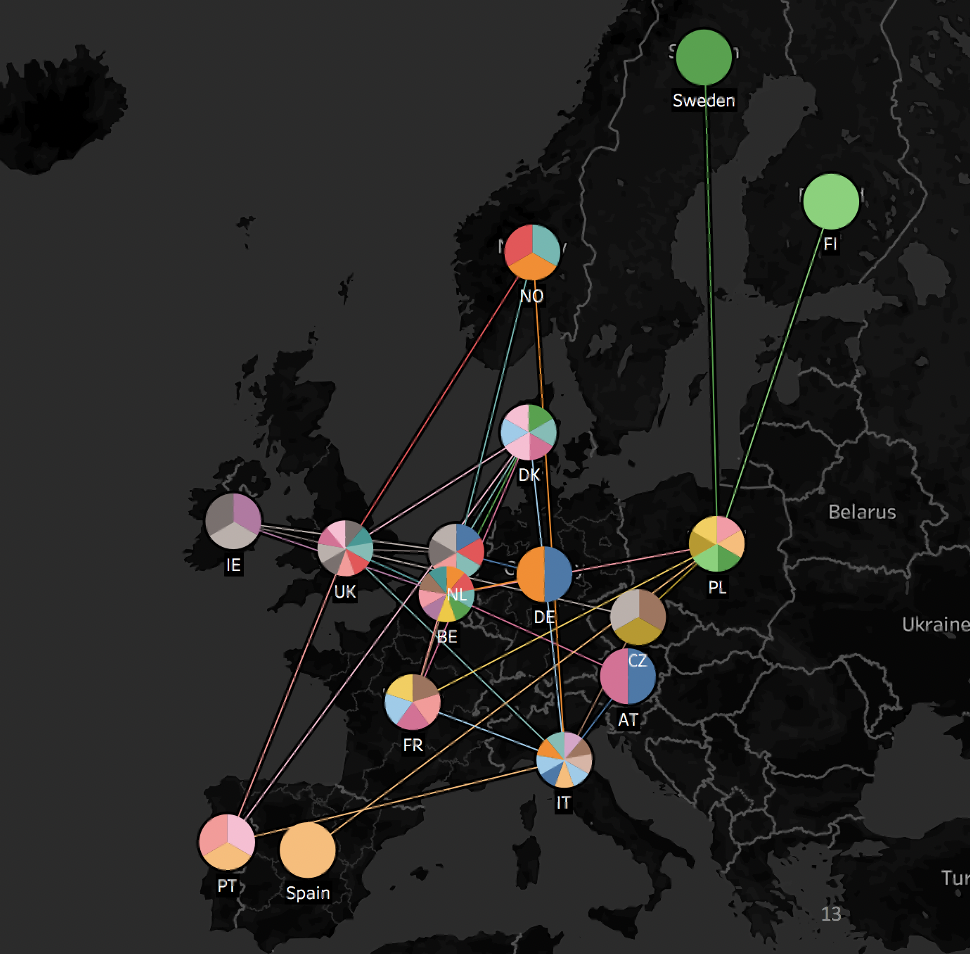

# Forecasting-for-Inventory-Management
This project aims to predict the quantity of flower containers that will be transacted to and from inventories in the future. The containers are collected from inventories, filled up with flowers by the supplier and distributed among retailers through Retail Distribution Channel (RDC), after selling all flowers, the empty containers are sent back to MyContainer co. by Retail Return Channel as shown below:

The structures of forecasting models used in this project are summarized in this repository. All files are started with DataPipeline preprocessing steps. After collecting, cleaning, filtering, aggregating and analysing data, the forecasting models are implemented and compared in terms of accuracy.

Each file contains a concept as explained the following:

## 1st: Diverse Aggregations & AR Methods
In this file the quantity of transacted containers in all italian inventories are shown. Various time aggregations (Daily, Weekly, Monthly and seasonally) are analysed. Moreover, ARMA and ARIMA methods are modeled through the analysis of AutoCorrelation Function(ACF) and Partial AutoCorrelation Function(PACF). The comparison among the results of AR family models and the outcome of the forecast() function of python is shown in this file. Then the most accurate model is chosen.

## 2nd: Prediction by Ordinary Least Squares
The core of this file is OLS regression. This method is used to find the correlation among transactions in diverse countries, so that the quantities transacted in a country can be achieved through a linear relationship that it has with other countries. The purpose is to forecast any random time-series by using the dependency that it has to other variables of data. In the picture below it is shown that each european country is independent or correlated to other countries.

## 3rd: SARIMA Model vs. Other AR Models (Netherlands)
This file takes into account the seasonality of the historical data of transactions in Netherlands. Seasonal AutoRegressive Integrated Moving Average is a model that takes the same parameters of ARIMA in addition to the seasonal manner of data. The accuracy of the outcome of SARIMA model is then compared with ARMA and ARIMA models.

## FbProphet
This is a forecasting tool developed by Facebook. The purpose for which I used it, is to compare the result gained by FbProphet and the AR models in other files.
